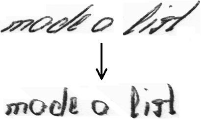
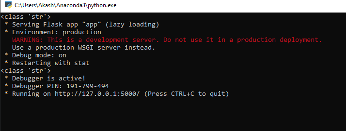
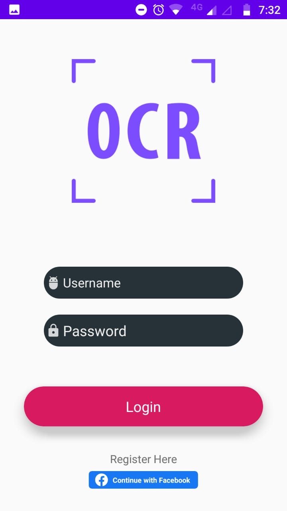
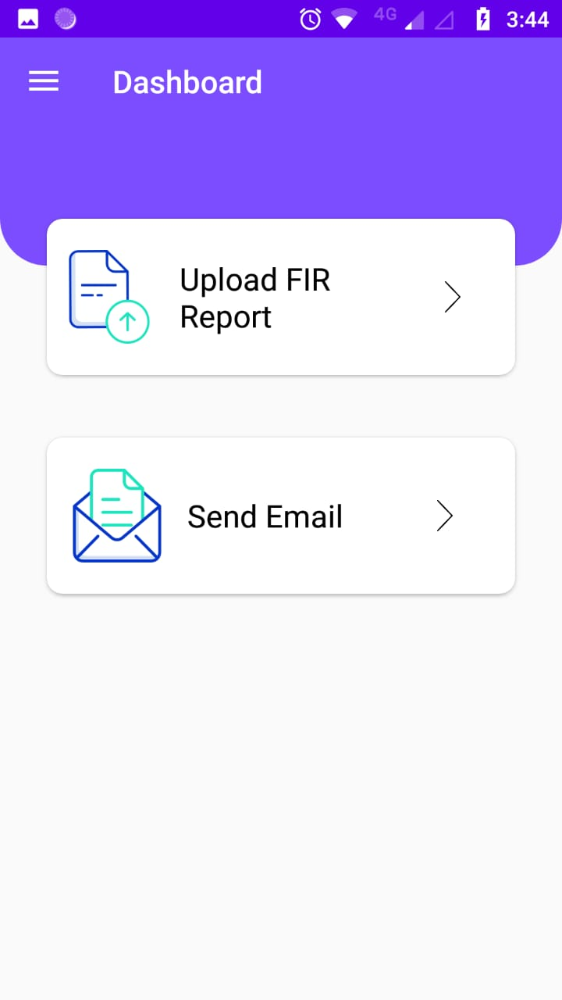
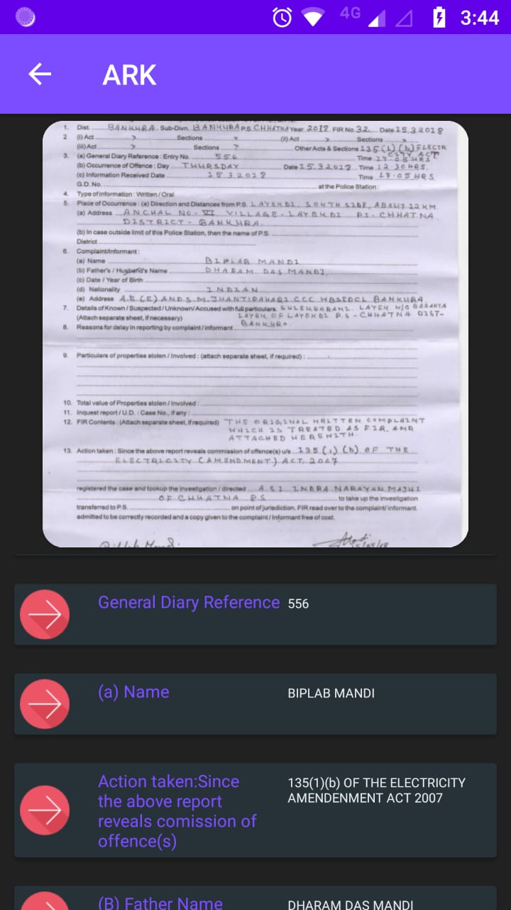

# CodemongerzSih2020NSUT
## This is a github repo for Sih Problem  Statement with PS Number:MS339
#### We have created an Android Application that takes an Image of FIR extract important features from it and convert it into digital form and shows it.
* #### First step that we have taken to create a ocr that can work with all type of handwriting is to deslant and remove cursive writing style.

* #### After that we used our ocr to extract the words from the uploaded image.

* ####  Now we used regular expression and string matching algorthims to extract the required fields
* #### Next step was to create a Server to run our Python Scripts for this Purpose we have used FLask to create a rest Api
# Steps to run the Android the Android Application
*  #### Clone the repository in a local directory
*  #### Create a Virtual Environment on your machine
* #### To create Virtual Environment on your machine use the following commands

For Windows:
 ```
  python -m venv ocr-env
  ocr-env\Scripts\activate.bat
 ```
  
 For Linux or Mac:
  ```
  python3 -m venv ocr-env
  source tutorial-env/bin/activate
 ``` 
 * #### To install all the requirements go into the directory of flask_api and run the following command
 ```
pip install -r requirements.txt
```
 * #### Now run app.py from the same directory you will see a screen like this if your server is running properly.
  
 * #### Your server is successfully running now. Now install the android application in your mobile and run it you will see prompted to a login page.
 
 
  To sucessfully login use these credentials
  Username:admin
  Password:admin
 
* #### After logging in you will a screen like this



* #### Click on Upload Fir and Upload your image.



* #### You will get the feature extracted from the image shown to you which you can Email or WhatsApp with the inbuilt feature of the application.
